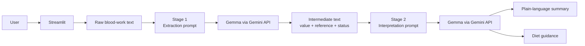

# Architecture

## Design goal

Blood Work Analyzer is a staged LLM pipeline built to separate **information extraction** from **interpretation**.

The project deliberately avoids one large prompt that must parse the report, classify every value, explain the result, and generate diet guidance in a single step. Instead, the system creates an intermediate representation first, then passes that output into a second model call.



## Component responsibilities

| Component | Responsibility | Does not own |
| --- | --- | --- |
| `app.py` | Input, rendering, session state, user-facing errors | Prompt logic |
| `prompts.py` | Stage 1 and Stage 2 model contracts | Model invocation |
| `service.py` | Two-stage orchestration and response splitting | UI state |
| Gemini / Gemma | Extraction and interpretation | Application validation |
| `sample_data/` | Demonstration input | Production document ingestion |
| `tests/` | Pipeline-contract verification with fake models | Clinical accuracy measurement |

## Stage 1: extraction and classification

Stage 1 receives the raw report text and asks the model to return each test value in a consistent line-oriented format:

```text
Test Name: value | Status: HIGH/LOW/NORMAL | Reference: range
```

The prompt asks the model to use the reference ranges included in the report itself.

This is still an LLM-generated intermediate representation. The current prototype does **not** independently parse units or deterministically recompute every status. That limitation is intentional to keep the project focused on staged orchestration, and it is also the clearest next area for hardening.

## Stage 2: interpretation

Stage 2 receives the Stage 1 output rather than the original report.

It produces two user-facing sections:

1. a short plain-language summary
2. practical Indian diet guidance

The response contract includes a known separator token so the service can split the model output into two independently rendered UI panels.

A typed structured-output schema would be stronger than a separator token, but the current approach makes the pipeline boundary visible and easy to test.

## Why two model calls?

The staged design creates several useful engineering properties:

- each prompt has a narrower responsibility
- intermediate output can be inspected independently
- failures can be isolated to one stage
- the second prompt receives cleaner context
- the service can be unit-tested with an injected fake model

The trade-off is additional latency and model usage compared with a single-call design.

## Failure handling

| Failure | Current behavior | Production hardening |
| --- | --- | --- |
| Empty report | Rejected before any model call | Keep deterministic validation |
| Missing/invalid API key | Provider error reaches UI error handling | Startup configuration check |
| Stage 2 omits separator | Service raises `ValueError` | Typed structured response schema |
| Stage 1 extracts a value incorrectly | Stage 2 inherits the mistake | Deterministic parser + schema validation |
| Units/reference ranges vary | Model interprets raw text | Normalize units and ranges in code |
| Model/provider latency | User waits during both stages | Timeouts, telemetry, faster model/fallback |

## Testing strategy

The model dependency is injectable. Tests use fake LLM responses, so the orchestration contract can be verified without API keys, external requests, or model cost.

Current tests verify:

- blank input is rejected before model execution
- a successful run uses two model calls
- summary and diet output are split correctly
- malformed Stage 2 output without the expected separator is rejected

GitHub Actions runs the suite on pushes and pull requests.

## What the tests do not prove

The test suite verifies **software behavior**, not medical correctness.

It does not currently measure:

- extraction accuracy across real laboratory formats
- status classification accuracy
- unit conversion quality
- hallucination rate
- clinical usefulness
- diet-guidance quality

Those would require a labeled evaluation dataset and domain review.

## Production evolution

The next architecture I would move toward is:

```text
PDF / report upload
      ↓
deterministic document parser
      ↓
typed lab-value schema
      ↓
unit + reference-range validation
      ↓
LLM explanation layer
      ↓
quality checks / citations
      ↓
user-facing summary
```

That would move factual parsing and status calculation out of the generative model while keeping the LLM focused on explanation.

## Scope and safety

This repository demonstrates staged LLM application architecture, dependency injection, failure handling, and testability. It is not clinically validated and should not be used for consequential medical decisions.
