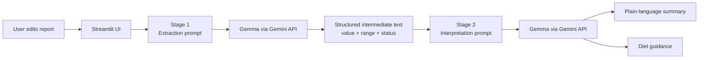

# Blood Work Analyzer

[Profile](https://github.com/kcrokkam) · [All projects](https://github.com/kcrokkam/agentic-ai-projects)

[](https://blood-work-analyzer-ajxxhudcgayqhcsinv7g9u.streamlit.app/)
[](https://github.com/kcrokkam/blood-work-analyzer/actions/workflows/tests.yml)


> A two-stage LLM application that separates report extraction from interpretation so each stage has a clearer responsibility and a testable contract.

**Why this project matters:** rather than asking one prompt to parse numbers, classify values, explain the result, and generate dietary guidance all at once, the workflow decomposes the task into two explicit stages. That makes the pipeline easier to inspect, test, and improve.

## Try it in 60 seconds

**Live app:** https://blood-work-analyzer-ajxxhudcgayqhcsinv7g9u.streamlit.app/

1. Open the app with the preloaded sample report.
2. Click **Analyze**.
3. Stage 1 extracts the reported values and labels them `HIGH`, `LOW`, or `NORMAL` using the reference ranges included in the report.
4. Stage 2 receives that intermediate output and produces a plain-language summary plus practical Indian diet guidance.
5. Edit a value in the report and run it again to see how the pipeline responds.

> This is a technical demonstration, not a medical diagnosis or substitute for professional medical advice.

## System flow



## What I engineered

- **Task decomposition** — extraction/classification and interpretation are separate model calls rather than one monolithic prompt.
- **Explicit intermediate state** — Stage 2 operates on Stage 1 output instead of directly rereading the raw report.
- **Prompt separation** — extraction and interpretation contracts live in a dedicated prompt module.
- **Failure handling** — blank input is rejected before an API call, and malformed second-stage output is rejected if the expected separator is missing.
- **Testable orchestration** — the service accepts an injected model dependency, so the pipeline can be tested with a fake LLM and no external API calls.
- **Deployable UI** — Streamlit presents the report, summary, and diet guidance in separate panels.

## Engineering decisions

| Decision | Why I made it | Trade-off |
| --- | --- | --- |
| Split the workflow into two LLM calls | Gives extraction and interpretation separate responsibilities | More latency and API usage than one call |
| Pass Stage 1 output into Stage 2 | Creates a visible intermediate representation | Stage 2 still depends on Stage 1 quality |
| Keep prompts separate from orchestration | Easier to inspect and revise model contracts | Adds a small amount of project structure |
| Inject the LLM into the service during tests | Tests the pipeline without API credits or credentials | Does not measure real-model quality |
| Use a separator contract for the final response | Lets the UI render summary and diet sections independently | A typed structured-output schema would be stronger |

## Reliability and testing

The test suite verifies the orchestration contract without calling Gemini:

- blank input is rejected before model execution
- the fake model is called in two stages
- the final response is split into summary and diet sections
- malformed output can be surfaced as an application error

CI runs the tests on every push and pull request through GitHub Actions.

**Current testing gap:** there is no clinical or extraction-accuracy benchmark. The next step would be a labeled evaluation set for report parsing, unit/reference-range handling, and stage-by-stage quality.

## Technology stack

| Technology | Role |
| --- | --- |
| Python | Application and pipeline logic |
| LangChain | Model integration |
| Gemini API | Model serving |
| Gemma | Extraction and interpretation model |
| Streamlit | Interactive UI and deployment |
| pytest | Pipeline tests with an injected fake model |
| GitHub Actions | Continuous test execution |
| uv | Dependency and environment management |

## Repository map

```text
.
├── app.py                           # Streamlit entry point
├── src/blood_work_analyzer/
│   ├── prompts.py                   # Stage 1 and Stage 2 prompt contracts
│   └── service.py                   # Two-stage orchestration and validation
├── tests/test_service.py            # Model-independent pipeline tests
├── sample_data/blood_work.txt       # Preloaded demo report
├── notebooks/prototype.ipynb        # Early prototype
├── ARCHITECTURE.md                  # Deeper system design notes
├── pyproject.toml
└── .github/workflows/tests.yml      # CI
```

For a deeper technical walkthrough, see [ARCHITECTURE.md](ARCHITECTURE.md).

## Run locally

```bash
git clone https://github.com/kcrokkam/blood-work-analyzer.git
cd blood-work-analyzer
uv sync --extra dev
cp .env.example .env
```

Add your Google API key to `.env`:

```env
GOOGLE_API_KEY=your_key_here
```

Run the app:

```bash
uv run streamlit run app.py
```

Run tests:

```bash
uv run pytest
```

## Limitations and next upgrades

Current limitations:

- model-generated extraction and interpretation can be wrong
- report values are not yet represented by a typed structured-output schema
- no PDF upload or deterministic document parsing yet
- no clinical validation or measured accuracy benchmark
- two model calls increase latency

The next engineering upgrades I would make are typed structured output, deterministic unit/reference-range validation, PDF ingestion, an evaluation dataset, latency/error telemetry, and model comparison against a faster production option.

> This repository demonstrates LLM application architecture and testing patterns. It should not be used for consequential medical decisions.
