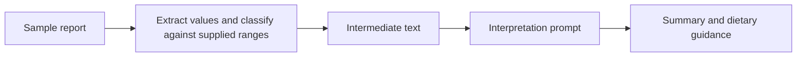

# Blood Work Analyzer

[About me](https://github.com/kcrokkam) · [My other projects](https://github.com/kcrokkam/agentic-ai-projects)

I built this to explore a two-stage LLM workflow using sample blood reports. The first stage extracts values and compares them with the report's reference ranges. The second uses that intermediate result to produce a plain-language summary and dietary guidance.

I chose separate stages so I could inspect the extraction step, keep the prompts focused, and test the orchestration independently of a live model. This is an educational project, with no clinical validation.

[Open the app](https://blood-work-analyzer-hcsq3acoxxkg3oedr5sxke.streamlit.app/) · [Architecture](ARCHITECTURE.md) · [Tests](tests/)

## Try it

Open the app, review the preloaded sample report, and select **Analyze**. The app displays the summary and dietary guidance separately. You can edit the sample values to explore how the output changes.

The output is model-generated and should not be used for medical decisions.

## How it works



Both stages use Gemma through the Gemini API. I keep the prompts in `prompts.py` and the orchestration in `service.py`. The service accepts an injected model, which lets the tests use a fake response sequence.

The service rejects blank input before making a model call. It also checks for the separator used to split the final response into summary and diet sections. The intermediate result is text; replacing it with a typed schema would give the pipeline a stronger contract.

## Code structure

| File or folder | Responsibility |
| --- | --- |
| `app.py` | Streamlit interface |
| `src/blood_work_analyzer/prompts.py` | Extraction and interpretation prompts |
| `src/blood_work_analyzer/service.py` | Two-stage execution and output validation |
| `sample_data/blood_work.txt` | Example report |
| `tests/test_service.py` | Tests with an injected model |
| `notebooks/prototype.ipynb` | Earlier prototype |

## Run locally

Use Python 3.12 and [uv](https://docs.astral.sh/uv/).

```bash
git clone https://github.com/kcrokkam/blood-work-analyzer.git
cd blood-work-analyzer
uv sync --extra dev
cp .env.example .env
```

Set `GOOGLE_API_KEY` in `.env`, then:

```bash
uv run streamlit run app.py
```

## Testing and next steps

```bash
uv run pytest
```

I test input validation, the two-stage call sequence, splitting the final response, and malformed output handling. [GitHub Actions](https://github.com/kcrokkam/blood-work-analyzer/actions/workflows/tests.yml) runs the tests without live Gemini calls.

These tests verify application behavior, not medical or extraction accuracy. I have not built a labeled evaluation set or deterministic unit/reference-range validation. Those, together with typed outputs and PDF parsing, are the next improvements I would make.

The default model is `gemini-3.1-flash-lite`. Each model request has a 20-second timeout and a 2,048-token output limit. I retry a failed pipeline stage once, after one second, for timeouts or temporary server errors (500, 502, 503, 504). Credential, model-access, and rate-limit failures are not retried. Logs record only the pipeline stage, error category, HTTP status, and exception type; they omit report text, model responses, and API keys. Set `GEMINI_MODEL` to use another model available to your account. A failed new analysis clears the previous result.
